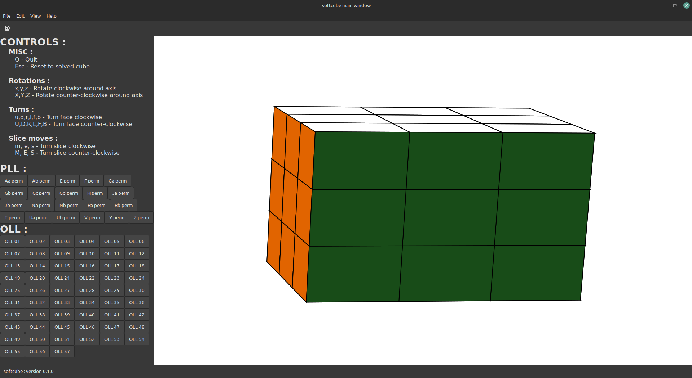

# SOFTCUBE

A program that helps you with memorizing Rubik's Cube algorithms...we'll it might eventually be that, for now it just shows the rubiks cube as a 3d object, and animates moves.

## LINKS

* I am using yackx:s package `rubik` as the internal representation for a Rubiks cube : https://github.com/yackx/go-rubik/issues

## DESCRIPTION

* Handles all normal moves (R,L,U,D,F and B)
* Handles all normal counterclockwise moves (R',L',U',D',F' and B')
* Handles slice moves (M,E and S)
* Handles slice counterclockwise moves (M',E' and S')
* Handled double layer moves (u,r,u,d,f and b)
* Handled double layer counterclockwise moves (u',r',u',d',f' and b')
* Handles cube rotations (x,y and z)
* Handles cube counterclockwise rotations (x',y' and z')
* Handles double moves for all the above (R2,M2,u2',x2' etc)

## TODO

* Still a visual glitch in the animation (z-order sorting)

## SCREENSHOT

